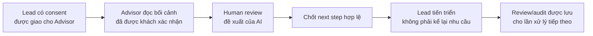
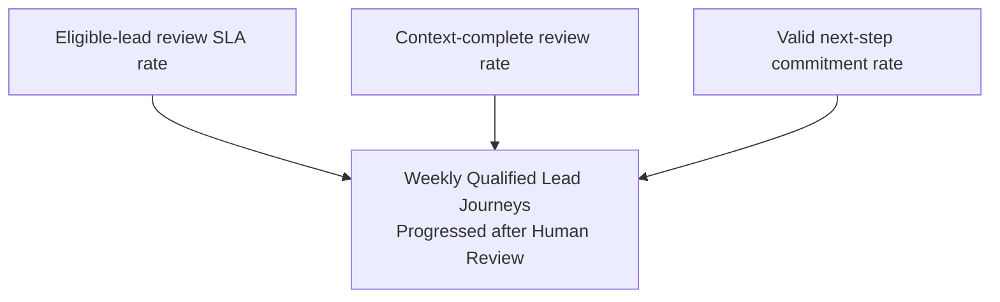
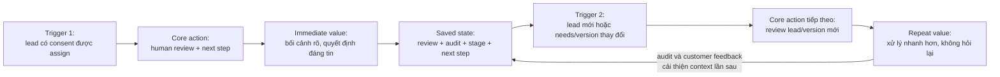

# ViVi Metrics Pack

**Học viên:** Nguyễn Thị Bảo Trang · **MHV:** 2A202602580  
**Dự án:** ViVi — Trợ lý tư vấn và vận hành bán hàng VinFast  
**Phạm vi:** một use case của Sales/Advisor; không đại diện cho toàn bộ sản phẩm.  
**Trạng thái:** metric specification cho giai đoạn prototype/pre-PMF; baseline và target cần đo sau khi có event pipeline.

## Tóm tắt chuỗi quyết định



**Core action:** tư vấn viên hoàn thành human review cho một lead đủ điều kiện và
chốt next step.  
**Natural cadence:** workflow theo lead; xảy ra trong ngày làm việc, đo ở cấp tuần.  
**North Star:** số lead đủ điều kiện mỗi tuần được tiến triển sau human review,
không bị sửa sai hoặc rollback trong 7 ngày.  
**Retention:** tư vấn viên quay lại hoàn thành review cho ít nhất ba lead khác
nhau trong một tuần mà họ được giao đủ ba lead đủ điều kiện.

---

# 00 — Dự án, persona, core job

| Mục | Quyết định |
|---|---|
| Dự án | ViVi — hành trình tư vấn xe điện thống nhất giữa Buyer và Sales |
| Business model/stage | Công cụ hỗ trợ bán hàng và tư vấn; prototype/pre-PMF |
| Persona duy nhất | Tư vấn viên VinFast phụ trách các lead online đã được khách đồng ý chia sẻ thông tin |
| Use case | Tiếp nhận lead, hiểu bối cảnh đã xác nhận, kiểm tra đề xuất AI và chốt next step |
| Core job, bằng lời người dùng | “Khi một khách đã sẵn sàng được tư vấn, tôi cần hiểu đúng nhu cầu của họ ngay, kiểm tra đề xuất của AI và đưa họ sang bước phù hợp mà không bắt họ kể lại từ đầu hoặc nhận tư vấn sai.” |
| Kết quả mong muốn | Lead tiến triển nhanh hơn, thông tin khách được giữ đúng nguồn gốc và mọi quyết định có human review/audit |

## Vì sao chọn Sales thay vì Buyer cho bài này?

Buyer mua xe theo dự án và có thể chỉ thực hiện hành vi giá trị một lần trong
nhiều năm. Nếu ép Buyer phải lặp lại booking để tạo retention, sản phẩm sẽ tối ưu
sai hướng. Với Sales, review lead là workflow lặp tự nhiên, có supply condition
rõ ràng và vẫn gắn trực tiếp với value của khách: không phải lặp lại nhu cầu và
không bị AI tự động đưa ra hành động chưa được kiểm tra.

---

# 01 — Core Action Card

## 1.1 Phân biệt bốn khái niệm

| Khái niệm | Định nghĩa trong ViVi |
|---|---|
| Core job | Hiểu đúng lead đã có consent và đưa lead sang next step phù hợp mà không hỏi lại thông tin đã xác nhận |
| Core action | Advisor hoàn thành human review cho một lead đủ điều kiện và chốt next step |
| Core value | Advisor xử lý lead nhanh, đúng bối cảnh; Buyer nhận tư vấn liên tục và có kiểm soát |
| Core value event | `lead_progressed_after_review` — lead chuyển sang một trạng thái tiếp theo hợp lệ sau review |

## 1.2 Core Action Card

| Thành phần | Câu trả lời |
|---|---|
| Target user | Tư vấn viên được phân công xử lý lead online |
| Core job | Hiểu đúng bối cảnh, kiểm tra AI và tiếp tục chăm sóc mà không bắt khách kể lại |
| Core action | Hoàn thành human review cho đề xuất của một lead và chốt next step |
| Object | Một `lead` đủ điều kiện cùng `recommendation_version` hiện hành |
| Preconditions | Lead có consent còn hiệu lực; đã được assign; có customer-confirmed needs; recommendation version chưa bị thay thế |
| Completion rule | Advisor chọn approve/edit/reject; nếu edit/reject phải có lý do; lưu `next_step_type`; review và audit được persist thành công |
| Core value | Một lead được xử lý bằng bối cảnh đáng tin cậy và có quyết định của con người |
| Evidence of value | Trong 24 giờ làm việc sau review, lead chuyển sang next step hợp lệ; trong 7 ngày không có correction/rollback do tư vấn sai |
| Candidate event | `lead_review_completed`; value event tổng hợp: `lead_progressed_after_review` |

> `lead_progressed_after_review` là derived event/metric condition, không nhất
> thiết phải được client bắn trực tiếp. Nó được suy ra từ review, stage transition
> và absence of correction/rollback trong quality window.

## 1.3 Tự kiểm 5 tiêu chí

| Tiêu chí | Đạt? | Rationale |
|---|:---:|---|
| Gần core value | ✅ | Review + next step là điểm nối trực tiếp giữa hiểu khách và tiến triển lead |
| Có thể lặp lại | ✅ | Lặp theo từng lead mới hoặc lead có nhu cầu cập nhật |
| Có thể quan sát | ✅ | Có trạng thái review, version, decision, next step và audit timestamp |
| Có ý nghĩa | ✅ | Tăng review đủ chất lượng giúp nhiều lead được xử lý đúng, không chỉ tăng click |
| Có thể tác động | ✅ | Team có thể cải thiện context, queue, data completeness và review UX |

### Phản biện các ứng viên bị loại

- **“Mở lead”** bị loại vì chỉ là thao tác giao diện, chưa có quyết định hay value.
- **“AI tạo đề xuất”** bị loại vì là output hệ thống, chưa chứng minh Advisor hoặc Buyer nhận value.
- **“Gửi follow-up”** bị loại vì có thể tối ưu thành spam; follow-up còn phụ thuộc nội dung và consent.
- **“Đặt lịch lái thử”** là outcome quan trọng nhưng phụ thuộc Buyer và slot; dùng làm downstream value signal, không dùng làm core action của Advisor.

## Gate 1

- [x] Có actor, object và completion rule.
- [x] Đạt 5/5 tiêu chí.
- [x] Không phải mở app, mở lead hoặc output AI.

---

# 02 — Action Nature Card + cadence

## 2.1 Action Nature Card

| Thành phần | Kết luận |
|---|---|
| Actor | Advisor account; aggregation chính ở cấp advisor và showroom/team |
| Intent | Xử lý lead được giao đúng và đủ nhanh để khách tiếp tục hành trình |
| Trigger | Lead mới có consent được assign; Buyer cập nhật nhu cầu; recommendation version mới cần review |
| Effort | Giả thuyết 3–10 phút/lead: đọc facts, kiểm tra trade-off/TCO, quyết định và chốt next step; cần đo thực tế |
| Value timing | Advisor có value ngay khi context đầy đủ; Buyer nhận value khi lead tiến sang next step; một phần value phụ thuộc phản hồi/slot |
| State | Confirmed needs, provenance, consent, recommendation version, review decision, reason, next step, stage và audit trail |
| Dependency | Lead supply, consent, data completeness, quyền/assignment, Buyer response và test-drive availability |
| Repeat condition | Có lead đủ điều kiện mới hoặc một lead hiện hữu có thay đổi material cần review version mới |

## 2.2 Dạng hành vi và kết luận cadence

**Dạng hành vi:** workflow của team, có trigger theo sự kiện.

> Đối với **tư vấn viên VinFast được giao lead online**, core action **hoàn thành
> human review và chốt next step cho một lead đủ điều kiện** thường xuất hiện
> **nhiều lần trong các ngày làm việc có lead mới hoặc lead thay đổi** vì **mỗi
> assignment/version mới tạo ra một nghĩa vụ xử lý độc lập**. Do đó, nhịp đo phù
> hợp là **theo tuần làm việc** ở cấp **advisor account**, đồng thời chẩn đoán ở
> cấp **lead/recommendation version**.

**Vì sao không dùng DAU:** một ngày không có lead đủ điều kiện không phải dấu hiệu
Advisor churn. Weekly window giảm nhiễu theo lịch làm việc và lead supply. Metric
frequency luôn dùng mẫu số là `eligible assigned leads`, không dùng tổng ngày.

## Gate 2

- [x] Cadence xuất phát từ trigger và repeat condition của workflow.
- [x] Nhịp tuần không mâu thuẫn với hành vi xảy ra trong ngày làm việc.
- [x] Không lấy daily/weekly theo thói quen dashboard.
- [x] Frequency cao hơn không mặc định tốt hơn; review phải đạt quality threshold.

---

# 03 — Metric System

## 3.1 Activation

| Thành phần | Định nghĩa |
|---|---|
| Start event | `lead_assigned` đầu tiên cho advisor, với `eligible_for_review=true` |
| Activation event | `lead_review_completed` đầu tiên cho chính lead đó, có decision + next step hợp lệ |
| Time window | Trong **1 ngày làm việc** kể từ assignment; tạm dừng clock ngoài giờ làm việc cấu hình của showroom |

**Activation rate** = số advisor hoàn thành review hợp lệ cho lead đủ điều kiện đầu
tiên trong 1 ngày làm việc / số advisor được giao lead đủ điều kiện đầu tiên.

Không dùng đăng nhập, xem tutorial hoặc mở lead làm activation vì chưa có human
decision và chưa tạo value.

## 3.2 Engagement — hai góc đo

### Frequency: Qualified weekly review rate

Tỷ lệ advisor-week có **ít nhất 3 `lead_review_completed` trên 3 lead khác nhau**,
trong số advisor-week được assign ít nhất 3 lead đủ điều kiện.

```text
qualified_weekly_review_rate
= advisor-weeks đạt >=3 distinct reviewed leads
  / advisor-weeks có >=3 eligible assigned leads
```

### Depth: Context-complete review rate

Tỷ lệ review hoàn tất khi lead có đủ: consent hợp lệ, năm nhu cầu cốt lõi đã được
khách xác nhận, provenance của từng fact và recommendation version hiện hành.

```text
context_complete_review_rate
= context-complete lead_review_completed
  / all lead_review_completed
```

## 3.3 North Star Metric

### Weekly Qualified Lead Journeys Progressed after Human Review

**Định nghĩa:** số lead khác nhau trong một tuần thỏa tất cả điều kiện:

1. Có consent hợp lệ và được assign đúng phạm vi.
2. Có `lead_review_completed` trên recommendation version hiện hành.
3. Có `lead_stage_progressed` sang next step hợp lệ trong vòng 24 giờ làm việc sau review.
4. Không có `customer_correction_recorded` liên quan tới facts/recommendation đã review.
5. Không rollback về stage trước vì tư vấn sai trong 7 ngày sau stage progression.

Đây là **unit of value (lead journey progressed)** + **quality threshold (human
review, đúng quyền/consent, không correction/rollback)** + **frequency (mỗi tuần)**.

```text
NSM_week
= COUNT(DISTINCT lead_id)
  WHERE consent_valid_at_review = true
    AND review_completed_at IS NOT NULL
    AND valid_stage_progression_at <= review_completed_at + 1 business day
    AND no_related_correction_or_error_rollback_within_7_days = true
```

- **Baseline:** `CẦN ĐO` sau tối thiểu 4 tuần production-like traffic.
- **Target:** `CẦN ĐẶT` sau khi có baseline và xác nhận lead mix.
- **Refresh:** weekly; quality window khiến số của 7 ngày gần nhất là provisional.
- **Owner đề xuất:** Sales Operations + Product Analytics.

### Vì sao không chọn các metric khác làm NSM?

- Số lượt chat: có thể tăng vì AI hỏi vòng vo hoặc hiểu sai.
- Số đề xuất AI: output hệ thống, chưa có human review hay customer value.
- Số lead được mở: activity vanity, dễ game.
- Số lịch lái thử: outcome tốt nhưng phụ thuộc Buyer, slot và showroom; dùng làm downstream signal, không phải thước đo duy nhất của review workflow.

## 3.4 Causal metric tree và leading indicators



| Leading indicator | Definition/formula | Vì sao dự báo NSM | Source |
|---|---|---|---|
| Eligible-lead review SLA rate | Lead đủ điều kiện được review trong 1 ngày làm việc / lead đủ điều kiện được assign | Review sớm tạo cơ hội tiến stage trong 24 giờ; team có thể cải thiện queue và context | `lead_assigned`, `lead_review_completed` |
| Context-complete review rate | Review có consent + đủ 5 confirmed needs + provenance + current version / tổng review | Context đủ làm giảm correction/rollback và giúp Advisor ra quyết định nhanh | `lead_context_viewed`, `lead_review_completed` properties |
| Valid next-step commitment rate | Review có `next_step_type` hợp lệ / tổng review hoàn tất | Không có next step thì review không chuyển thành tiến triển hành trình | `lead_review_completed`, `lead_next_step_committed` |

Ba indicator trên là **leading**; NSM là outcome **lagging** vì phải đợi quality
window 7 ngày để xác nhận không có correction/rollback.

## 3.5 Counter-metrics

| Counter-metric | Cách tính | Hành vi xấu cần bắt |
|---|---|---|
| Customer correction rate (7 ngày) | Lead có `customer_correction_recorded` trong 7 ngày sau review / lead đã review | Review nhanh bằng cách tin AI hoặc dùng fact sai |
| Review reopen/rollback rate | Review bị reopen hoặc lead rollback do `advice_error` / review hoàn tất | Đóng review để đạt SLA rồi sửa lại sau |
| Test-drive cancel/no-show rate | Lịch hủy/no-show / lịch đã xác nhận bắt nguồn từ reviewed lead | Ép lead sang test drive không phù hợp chỉ để tăng progression |

## 3.6 Dashboard tối thiểu

- **Weekly outcome view:** NSM, W1–W4 qualified retention, correction rate, cancel/no-show rate.
- **Team operational view:** review SLA, context completeness, next-step commitment, eligible lead supply.
- **Diagnostic view:** theo showroom, advisor tenure, lead source, recommendation version và reason code.

## Gate 3A — Metric System

- [x] Activation có start, activation event và business-time window.
- [x] Engagement chỉ dùng hai góc: frequency và depth.
- [x] NSM đủ unit of value + quality threshold + frequency.
- [x] Có ba leading indicators với causal rationale.
- [x] Có counter-metrics cụ thể để chống gaming.

---

# 04 — Retention Definition

## 4.1 Sáu thành phần

| Thành phần | Định nghĩa |
|---|---|
| Unit | Advisor account |
| Cohort entry | Tuần đầu tiên advisor phát sinh `lead_review_completed` hợp lệ |
| Return event | `lead_review_completed` hợp lệ cho một `lead_id` khác hoặc một material `recommendation_version` mới |
| Window | Rolling work-week cohort W1, W2, W3, W4; tuần tính theo múi giờ `Asia/Bangkok` và lịch làm việc showroom |
| Threshold | Ít nhất 3 review hợp lệ trên 3 lead/version độc lập trong mỗi tuần |
| Segment | Advisor được assign ít nhất 3 eligible consented leads trong tuần; báo cáo tách new advisor (<30 ngày) và established advisor |

## 4.2 Câu định nghĩa đầy đủ

> **Wn qualified advisor retention** là tỷ lệ advisor có cohort entry ở tuần đầu
> tiên họ hoàn thành một `lead_review_completed`, và trong tuần Wn tiếp tục hoàn
> thành ít nhất ba review hợp lệ trên ba lead hoặc material recommendation version
> khác nhau, chỉ tính các advisor được assign ít nhất ba eligible consented leads
> trong tuần đó; cửa sổ dùng lịch làm việc showroom theo `Asia/Bangkok`.

```text
Wn_retention
= retained eligible advisors in Wn
  / cohort advisors who are supply-eligible in Wn
```

### Quy tắc denominator

- Advisor có ít hơn 3 eligible assigned leads trong tuần được gắn `supply_ineligible` và không vào mẫu số chính.
- Vẫn hiển thị một diagnostic rate với threshold `min(3, eligible_leads)` để phát hiện vấn đề ở showroom nhỏ, nhưng không trộn với retention chuẩn.
- Nghỉ phép/toàn bộ tuần không active được loại bằng lịch nhân sự đã phê duyệt, không suy ra từ thiếu event.

### Benchmark đúng

So sánh với chính ViVi theo ba mốc: tuần tự nhiên của workflow, cohort cùng
tenure/lead supply và xu hướng nội bộ qua nhiều cohort. Không áp benchmark D7
của consumer app cho workflow B2B/team này.

## Gate 3B — Retention

- [x] Đủ unit, cohort entry, return event, window, threshold và segment.
- [x] Khớp cadence tuần ở Phase 2.
- [x] Có supply eligibility để tránh diễn giải sai.
- [x] Không dùng “D7 retention” trơ trọi.

---

# 05 — Product Loop

**Loại loop chính:** workflow loop ở cấp advisor account; trigger theo sự kiện.

## 5.1 Hai chu kỳ



**Reason to return khi bỏ notification:** queue công việc có lead mới được assign
và lead hiện hữu thay đổi nhu cầu/recommendation version. Notification chỉ báo
trigger nhanh hơn; nó không tạo ra nhu cầu xử lý.

## 5.2 Metric hypothesis

> Nếu shared customer memory, provenance và review queue của loop hoạt động,
> **Weekly Qualified Lead Journeys Progressed after Human Review** sẽ **tăng so
> với baseline** trong **4 tuần triển khai**, vì Advisor có đủ context để hoàn
> thành review và chốt next step nhanh hơn; đồng thời **customer correction rate
> không được tăng**.

## Gate 4A — Loop

- [x] Có hai chu kỳ và saved state rõ ràng.
- [x] Reason to return không phải notification.
- [x] Hypothesis trỏ trực tiếp tới NSM và counter-metric.

---

# 06 — Tracking nhanh

## 6.1 Event map

| Tên event | Ý nghĩa — điều đã xảy ra | Thời điểm ghi nhận | Metric sử dụng |
|---|---|---|---|
| `lead_assigned` | Một lead có consent đã được giao cho advisor | Sau khi assignment được persist và authorization check thành công | Activation start; eligible supply; review SLA |
| `lead_context_viewed` | Advisor đã mở đúng version của confirmed needs/provenance | Khi server trả context thành công và UI render version đó; không bắn theo page load chung | Context diagnostic; time-to-review |
| `lead_review_started` | Advisor bắt đầu một review session cho current recommendation version | Khi review record chuyển `not_started → in_progress` | Funnel diagnostic; review duration |
| `lead_review_completed` | Human review đã có decision, reason khi cần và next step hợp lệ | Khi transaction lưu review + audit thành công | Core action; activation; engagement; retention; NSM input |
| `lead_next_step_committed` | Next step hợp lệ đã được persist cho lead | Sau validation của stage/owner/consent và commit thành công | Next-step commitment; NSM input |
| `lead_stage_progressed` | Lead đã chuyển sang stage sau theo state machine | Chỉ khi server commit một valid forward transition | NSM; progression time |
| `customer_correction_recorded` | Customer/Advisor ghi nhận một fact hoặc recommendation đã review cần sửa | Khi correction gắn với `lead_id`, `review_id` và field/version cụ thể được persist | NSM quality exclusion; correction counter-metric |
| `test_drive_status_changed` | Một lịch lái thử chuyển trạng thái hợp lệ | Khi server commit `requested/confirmed/completed/cancelled/no_show` | Downstream value; cancel/no-show counter-metric |

## 6.2 Thuộc tính bắt buộc chung

Mọi event có: `event_id`, `occurred_at_utc`, `received_at_utc`, `actor_id`,
`actor_role`, `showroom_id`, `lead_id`, `session_id`, `source`, `app_version` và
`environment`. Các event review thêm `review_id`, `recommendation_version`,
`consent_version`, `decision`, `next_step_type`, `context_complete` và
`confirmed_needs_count`.

Không gửi nội dung hội thoại hoặc PII thô vào analytics event. Chỉ dùng ID giả
danh và categorical properties; dữ liệu chi tiết nằm trong domain store có RBAC.

## 6.3 Identity và time rules

- `actor_id` là advisor identity đã xác thực; không dùng browser/device ID làm unit retention.
- `lead_id` và `review_id` do server cấp.
- Lưu timestamp ở UTC; chuyển `Asia/Bangkok` khi tạo work-week dashboard.
- Business-time SLA dùng calendar showroom, không lấy 24 giờ tuyệt đối qua cuối tuần.
- Loại traffic `environment != production`, seed/demo profiles, bot và tài khoản nội bộ khỏi metric chính.

## 6.4 Acceptance criteria

1. Với mỗi cặp `review_id + recommendation_version`, hệ thống chỉ ghi một
   `lead_review_completed` khi trạng thái chuyển từ `in_progress` sang
   `completed` và transaction đã lưu đủ decision, reason bắt buộc, next step và
   audit. Bấm lại, reload hoặc retry với cùng idempotency key không tạo event mới.
2. `lead_stage_progressed` chỉ được ghi khi state machine commit một forward
   transition hợp lệ. Mở Kanban, kéo rồi thả về vị trí cũ hoặc request bị RBAC/
   version conflict từ chối không được ghi event.
3. `customer_correction_recorded` phải có `review_id`, `field_name`,
   `previous_value_hash`, `correction_source` và `reason_code`; cùng correction
   id không được tính lặp do retry.
4. `test_drive_status_changed` chỉ ghi khi trạng thái thực sự đổi. Reload calendar,
   autosave hoặc gửi lại cùng `appointment_id + from_status + to_status` không
   tạo thêm transition.

## 6.5 Metric-to-event coverage

| Metric | Event/dữ liệu tối thiểu |
|---|---|
| Activation rate | `lead_assigned`, `lead_review_completed`, business calendar |
| Qualified weekly review rate | `lead_assigned`, `lead_review_completed` |
| Context-complete review rate | `lead_review_completed.context_complete` và confirmed-needs properties |
| NSM | Review + next step + stage progression + correction/rollback quality window |
| W1–W4 retention | `lead_review_completed`, eligible assignment supply, advisor roster |
| Correction rate | `lead_review_completed`, `customer_correction_recorded` |
| Cancel/no-show rate | `test_drive_status_changed` |

## Gate 4B — Tracking

- [x] Có 8 event, nằm trong giới hạn 4–8.
- [x] Mọi event map về metric hoặc diagnostic cần thiết.
- [x] Core event chỉ bắn sau server-side completion.
- [x] Có idempotency/deduplication và state-transition rules.
- [x] Mọi metric chính đều có event/dữ liệu để tính.

---

# 07 — Tự soi lỗi, revision và kế hoạch kiểm chứng

## 7.1 Checklist bảy lỗi kinh điển

- [x] Core action không phải mở app, mở lead hay output hệ thống.
- [x] Activation không phải đăng nhập hoặc hoàn thành hướng dẫn.
- [x] Frequency có denominator theo eligible lead supply, không ép sử dụng hằng ngày.
- [x] Reason to return là assignment/version mới, không phải notification.
- [x] Retention window khớp workflow tuần.
- [x] Mọi event map về metric/diagnostic có mục đích.
- [x] Mọi metric chính có event, identity, trigger và window để tính.

## 7.2 Revision rationale

> Ban đầu có thể chọn Buyer đặt lịch lái thử làm core action. Tôi đổi sang
> **Advisor hoàn thành review và chốt next step** vì booking xe là hành vi thưa,
> phụ thuộc Buyer và availability, không phù hợp để xây retention lặp. Booking
> vẫn được giữ làm downstream value/counter signal, còn review workflow cho phép
> đo lường lặp tự nhiên mà không khuyến khích spam hay tạo thêm bước không cần thiết.

## 7.3 Giả định cần xác minh

1. Advisor thực sự xử lý ít nhất ba eligible leads/tuần ở phần lớn showroom.
2. Năm trường needs của prototype là đủ để gọi context complete.
3. Một ngày làm việc là SLA hợp lý cho first review.
4. Bảy ngày đủ để quan sát correction/rollback liên quan tới chất lượng tư vấn.
5. Advisor có quyền chốt một next step sau review, thay vì chỉ chuyển cho role khác.

## 7.4 Phép thử đầu tiên sau khi có tracking

- Chạy shadow analytics 4 tuần; chưa gắn incentive cá nhân.
- So sánh event với audit/domain records để kiểm tra completeness và duplicate.
- Phỏng vấn 5–8 advisor ở showroom có lead mix khác nhau để xác nhận effort, trigger và threshold.
- Đặt baseline theo cohort tenure và eligible lead supply.
- Chỉ đặt target sau khi event quality đạt yêu cầu và correction window đã đóng.

## Gate 5

- [x] Đã tự soi đủ bảy lỗi.
- [x] Có revision rationale.
- [x] Có giả định và kế hoạch kiểm chứng, không trình bày hunch như sự thật.

---

# Phụ lục — Metric Definition Contract

| Thành phần | Quy ước |
|---|---|
| Metric owner | Sales Operations + Product Analytics; Product phê duyệt thay đổi definition |
| Source of truth | Server-side domain events và audit records, không dùng client click làm source chính |
| Refresh | Operational: gần real-time; NSM/retention: weekly |
| Baseline/target | `CẦN ĐO` / `CẦN ĐẶT` |
| Review rhythm | Review định nghĩa mỗi quý hoặc khi workflow/state machine thay đổi |
| Amendment rule | Version metric definition; annotate ngày thay đổi; không viết lại lịch sử âm thầm |
| Data quality | Theo dõi event completeness, duplicate rate, late arrival và identity mismatch |

## Định nghĩa hoàn tất

Metrics Pack tạo thành một chuỗi có thể kiểm chứng:

> **Lead đủ điều kiện → human review có next step → progression đạt quality
> threshold → workflow lặp theo assignment tự nhiên → event server-side kiểm
> chứng từng mắt xích.**
