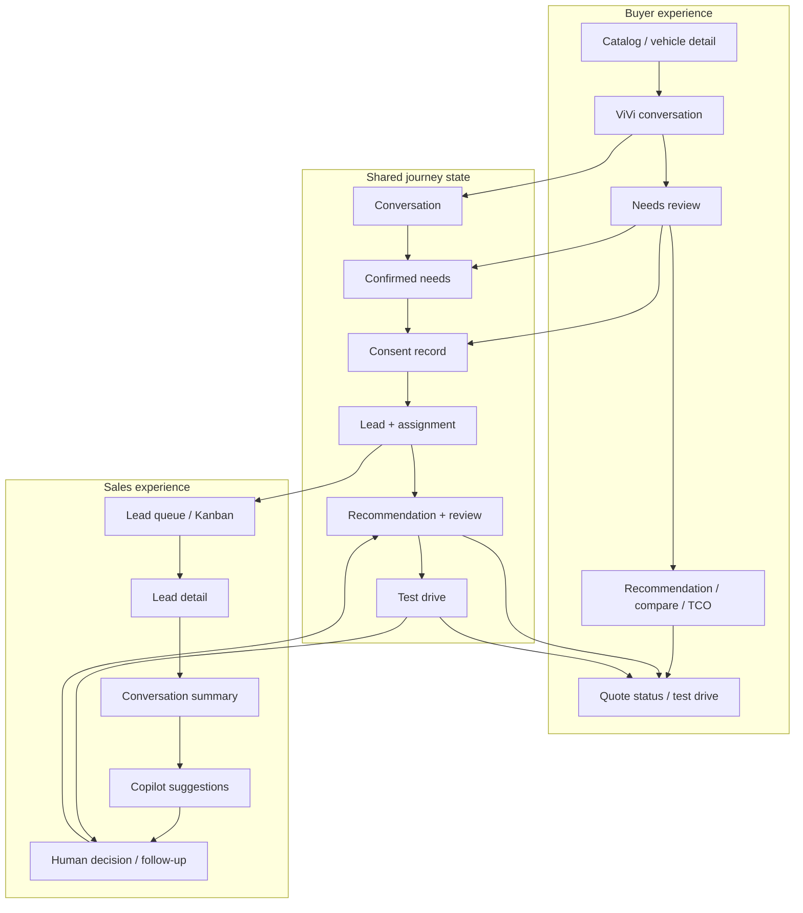
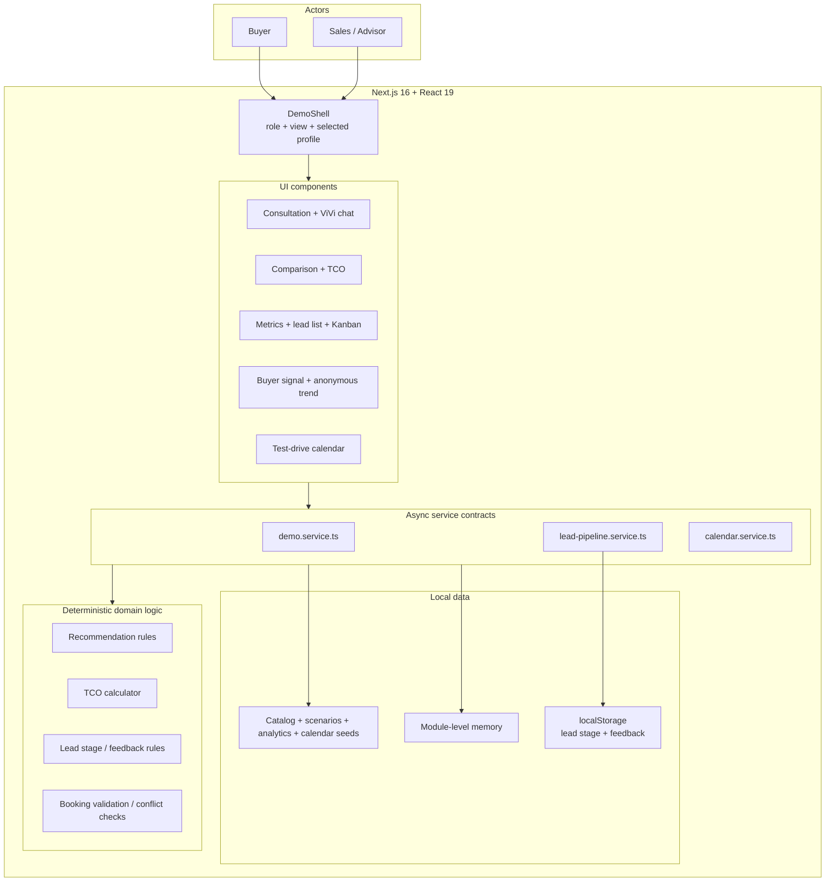
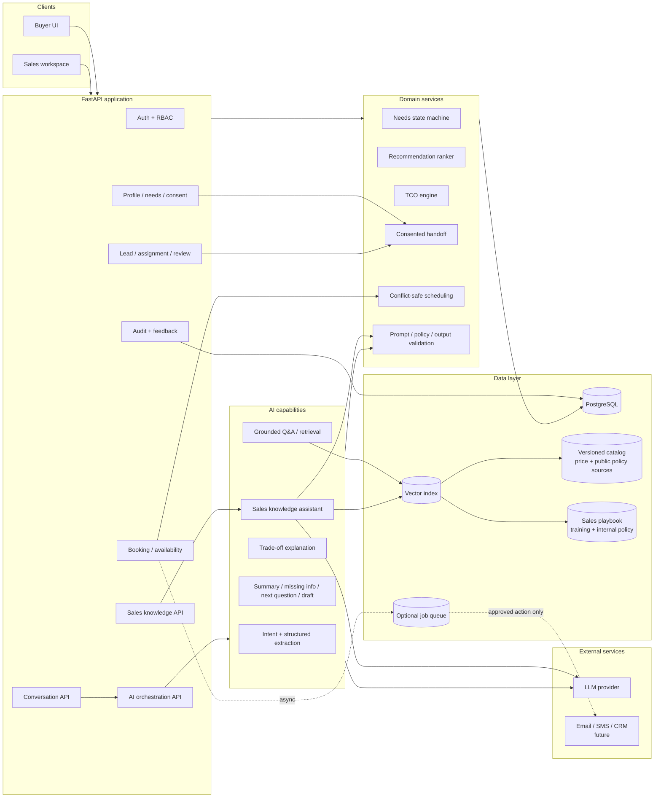
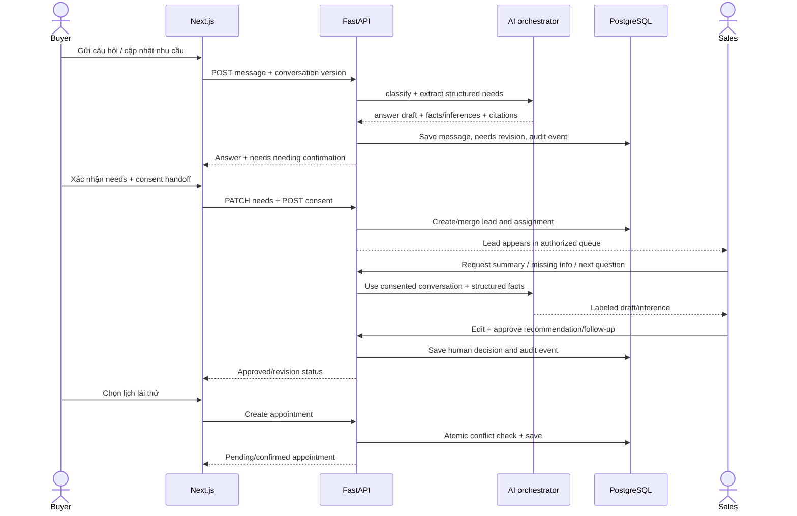
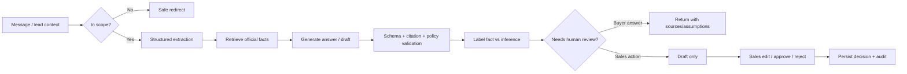
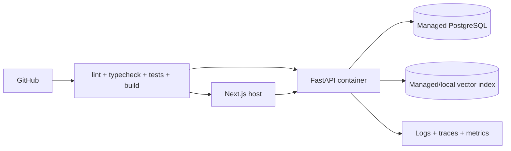

# ViVi Architecture

Tài liệu này tách rõ hai trạng thái:

- **Current / as-built:** frontend prototype đang chạy trong repo.
- **Target / tuần backend:** kiến trúc cần triển khai để nối hai luồng Buyer và
  Sales bằng dữ liệu bền vững, quyền truy cập và AI có kiểm soát.

## 1. Product boundaries

ViVi là một sản phẩm với hai experience chạy song song:



Điểm handoff chỉ xảy ra sau khi Buyer xem lại nhu cầu và đồng ý chia sẻ. Sales
chỉ thấy hồ sơ được phân công hoặc thuộc phạm vi được cấp quyền.

## 2. Current architecture — frontend prototype

### 2.1 Runtime component diagram



### 2.2 Current responsibilities

| Component | Responsibility |
|---|---|
| `DemoShell` | Bootstrap data, đổi role/view, giữ profile đang dùng |
| Buyer components | Catalog, chat, discovery, recommendation, compare, TCO, booking |
| Advisor components | Metrics, anonymous trend, lead/profile, buyer signal, review, Kanban |
| Calendar components | Availability, create/update/confirm/cancel appointment |
| `demo.service.ts` | Profile store, rule-based chat, recommendation, review, basic booking |
| `lead-pipeline.service.ts` | Role checks, stage persistence, customer feedback |
| `calendar.service.ts` | Calendar store, conflicts, role-filtered results, profile sync |
| `src/data/*` | Seed catalog, questions, profiles, analytics and appointments |
| `src/lib/*` | TCO, lead stages, formatting and result helpers |

### 2.3 Current persistence and trust boundary

| Data | Storage | Lifetime / limitation |
|---|---|---|
| Profiles, messages, needs, recommendations | Module memory | Reset theo frontend runtime |
| Appointments | Module memory | Không đồng bộ giữa browser/user |
| Lead stage, customer feedback | Browser `localStorage` | Chỉ cùng browser |
| Catalog, AI signals, anonymous trend | Source/seed files | Static, không phải AI output thật |
| Auth/role | UI role switch | Không phải security boundary |

Root `src/main.py` đã khai báo FastAPI nhưng import `src.api.routes`, file này
chưa tồn tại. Vì vậy backend hiện chưa nằm trong runtime và Docker health check
cũng chưa thể pass.

## 3. Target architecture — backend and AI



### Architectural rules

1. Frontend chỉ gọi typed API; không gọi model provider trực tiếp.
2. Recommendation constraints và TCO là deterministic services; LLM chỉ diễn
   giải, không tự tạo giá hay thông số.
3. Mọi factual answer về xe/chính sách phải grounded trên nguồn có version và
   ngày hiệu lực.
4. Handoff sang Sales cần consent record và audit event.
5. AI-generated summary/inference/draft không được ghi đè customer-confirmed
   facts.
6. Follow-up chỉ là draft cho tới khi Sales sửa và bấm duyệt/gửi.
7. RBAC, tenant/showroom scope và assignment được kiểm tra ở server, không dựa
   vào role switch phía client.
8. Sales knowledge retrieval phải lọc tài liệu theo quyền của người hỏi trước
   khi đưa context cho model; citation không được làm lộ tài liệu ngoài scope.

## 4. End-to-end data flow



### Concurrency/versioning

- `Conversation`, `NeedsState`, `Recommendation` và `Lead` nên có `version`.
- Client gửi `expected_version`; conflict trả `409` thay vì ghi đè thay đổi mới.
- Booking dùng transaction/unique constraint theo vehicle/showroom/time range.
- Các action dễ retry dùng idempotency key: handoff, create booking, approval.

## 5. Data model

Các entity P0:

| Entity | Fields quan trọng |
|---|---|
| `User` | id, role, showroom/tenant scope, status |
| `CustomerProfile` | contact, vehicle interest, source, consent scope |
| `Conversation` / `Message` | actor, text, timestamp, model/prompt version, citations |
| `NeedFact` | key, value, provenance, confidence, status, revision |
| `ConsentRecord` | purpose, data scope, granted/revoked time, policy version |
| `Lead` | profile, assignee, stage, source, latest activity, version |
| `Recommendation` | ranked vehicles, constraints, reasons, assumptions, status |
| `TcoSnapshot` | inputs, formula version, values, currency, created_at |
| `SalesNote` | author, body, visibility, created_at |
| `AiArtifact` | type, input refs, output, confidence, review status, reviewer |
| `TestDrive` | customer, vehicle, showroom, salesperson, time, status |
| `AuditEvent` | actor, action, object, before/after refs, timestamp |

`NeedFact.provenance` tối thiểu có bốn loại:

```text
customer_confirmed   Khách đã xác nhận; nguồn sự thật ưu tiên
sales_observed       Ghi chú/quan sát của tư vấn viên
ai_inferred          Suy luận của model; không được hiển thị như fact
anonymous_aggregate  Chỉ số nhóm; không gắn ngược về cá nhân
```

## 6. Proposed API surface

Đây là contract đề xuất để thay mock services mà không phải viết lại UI:

| Method | Endpoint | Purpose |
|---|---|---|
| `GET` | `/health` | Liveness/readiness cơ bản |
| `POST` | `/api/v1/conversations` | Mở hoặc tiếp tục session |
| `POST` | `/api/v1/conversations/{id}/messages` | Chat + structured extraction |
| `GET/PATCH` | `/api/v1/profiles/{id}/needs` | Đọc/sửa/xác nhận needs state |
| `POST` | `/api/v1/profiles/{id}/consents` | Ghi nhận phạm vi handoff |
| `POST` | `/api/v1/leads` | Create/merge lead idempotently |
| `GET` | `/api/v1/leads` | Queue có filter và RBAC |
| `GET` | `/api/v1/leads/{id}` | Shared customer context |
| `POST` | `/api/v1/recommendations` | Rank + reasons + TCO snapshot |
| `POST` | `/api/v1/recommendations/{id}/review` | Approve/revision by Sales |
| `POST` | `/api/v1/copilot/lead-summary` | Labeled summary draft |
| `POST` | `/api/v1/copilot/missing-information` | Gap detection |
| `POST` | `/api/v1/copilot/next-question` | Suggested question + rationale |
| `POST` | `/api/v1/copilot/follow-up-draft` | Draft only; never auto-send |
| `POST` | `/api/v1/sales-knowledge/chat` | RAG chat trên knowledge base được phân quyền |
| `GET` | `/api/v1/sales-knowledge/sources/{id}` | Mở source/citation nếu user có quyền |
| `GET` | `/api/v1/test-drives/availability` | Available slots |
| `POST/PATCH` | `/api/v1/test-drives` | Create/update appointment |
| `POST` | `/api/v1/test-drives/{id}/confirm` | Advisor confirmation |
| `POST` | `/api/v1/ai-artifacts/{id}/review` | Accept/edit/reject AI output |

Response errors nên thống nhất:

```json
{
  "error": {
    "code": "VERSION_CONFLICT",
    "message": "Dữ liệu đã thay đổi, vui lòng tải lại.",
    "request_id": "req_...",
    "details": {}
  }
}
```

## 7. AI orchestration and human review



Không dùng một prompt lớn cho toàn bộ hành trình. Tách capability và schema:

- `intent_and_scope`
- `extract_needs`
- `grounded_vehicle_qa`
- `explain_recommendation`
- `summarize_lead`
- `detect_missing_information`
- `suggest_next_question`
- `draft_follow_up`
- `sales_knowledge_chat`

Mỗi artifact lưu `model`, `prompt_version`, `input_refs`, `output_schema`,
`latency`, `token_usage`, `citations` và trạng thái review.

## 8. Implementation order for this week

### P0 — phải có để hai luồng thật sự nối nhau

1. Làm backend boot được: `src/api/routes.py`, config validation, health/readiness,
   error envelope và test client.
2. PostgreSQL + migration cho profile, conversation, needs, consent, lead,
   recommendation/review, appointment và audit.
3. API conversation/needs + handoff có consent; nối `demo.service.ts` sang adapter
   HTTP nhưng giữ mock adapter cho story/demo.
4. Recommendation/TCO deterministic ở server, có formula/source version.
5. Lead queue/detail, assignment và review gate với RBAC.
6. Availability/booking dùng transaction và conflict handling.

### P1 — AI value trên cùng luồng

1. Intent/scope + structured extraction; Buyer xác nhận trước khi lưu fact.
2. RAG Q&A từ catalog/chính sách đã kiểm duyệt.
3. Sales copilot: summary, missing info, next question, follow-up draft.
4. Human review UI + audit cho mọi AI artifact dẫn tới hành động.
5. Eval dataset và regression tests cho groundedness, extraction và refusal.

### P2 — làm sau cùng, chỉ bắt đầu khi toàn bộ P0/P1 đã hoàn tất

- CRM/notification integration.
- Async jobs, retries và dead-letter handling.
- Advanced buyer signals, model monitoring và analytics mở rộng.
- Multi-showroom/tenant hardening.
- **Hai feature cuối — Sales Knowledge Assistant:** RAG trên playbook, tài liệu
  đào tạo và chính sách nội bộ; citation, access filter và xử lý `không tìm thấy`.
- **Hai feature cuối — Anonymous interest aggregation:** tổng hợp mối quan tâm theo
  nhóm, không định danh cá nhân; có privacy threshold và không truy ngược về
  từng session.

Hai mục in đậm ở trên là hai feature cuối roadmap. Seed anonymous trend hiện có
trong frontend chỉ dùng để thể hiện ý tưởng UI, không phải dấu hiệu rằng pipeline
analytics này đã được ưu tiên triển khai.

## 9. Test strategy and release gates

| Layer | Minimum gate |
|---|---|
| Domain | Unit tests cho TCO, recommendation constraints, stage transitions |
| API | Auth/RBAC, consent, idempotency, version conflict, validation |
| Database | Migration test, rollback, booking concurrency |
| Contract | Frontend adapter vs OpenAPI schema |
| AI extraction | Exact/partial field accuracy và provenance correctness |
| RAG answer | Citation validity, groundedness, stale-source handling |
| Sales knowledge | Document-level authorization, citation access, no-answer behavior |
| Sales copilot | Không biến inference thành fact; output luôn là draft |
| E2E | Buyer → consent → Sales → approval → booking |
| Security | Secret scan, PII-safe logs, unauthorized access tests |

Không gọi backend/AI là hoàn thành chỉ vì endpoint trả `200`. Release gate cần
có: happy path, negative cases, authorization, persistence qua restart, audit
trail và ít nhất một deployed smoke test.

## 10. Deployment target



Production requirements: HTTPS, secret manager, database backups, PII redaction,
request IDs, structured logs, rate limiting, CORS allowlist, model timeouts,
fallback behavior và documented data-retention policy.
