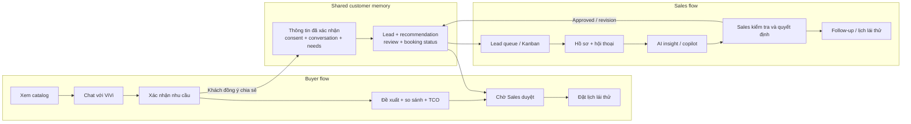
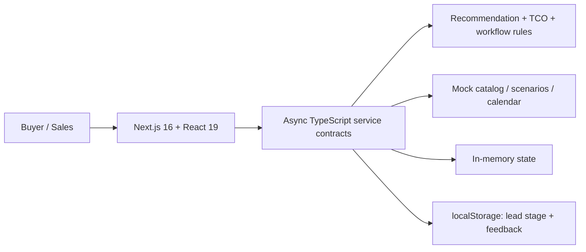

# ViVi — Trợ lý tư vấn và vận hành bán hàng VinFast

ViVi là một hành trình tư vấn xe điện thống nhất cho hai phía **Buyer** và
**Sales**. Buyer được giúp làm rõ nhu cầu, hiểu vì sao một mẫu xe phù hợp, so
sánh TCO và đặt lịch lái thử. Sales nhận lại đúng bối cảnh mà khách đã đồng ý
chia sẻ, kiểm tra đề xuất của AI và tiếp tục chăm sóc mà không bắt khách kể lại
từ đầu.

> **Trạng thái hiện tại:** frontend prototype đã thể hiện được luồng sản phẩm;
> backend, database và LLM thật chưa được tích hợp. Giá xe, thông số và TCO là dữ
> liệu minh họa, không phải báo giá VinFast hiện hành.

## Product flow

Hai luồng chạy song song nhưng dùng chung một hồ sơ khách hàng:



Nguyên tắc khác biệt của sản phẩm:

- Buyer không phải lặp lại nhu cầu khi chuyển sang tư vấn viên.
- Sales không phải ghi nhớ thủ công nhiều lead rời rạc.
- Dữ liệu khách xác nhận, ghi chú của Sales và suy luận AI phải được phân biệt.
- Mọi nội dung AI dùng để tư vấn hoặc liên hệ khách đều cần con người kiểm tra.

## Những gì đã có trong UI

### Buyer

- Catalog ô tô cá nhân, xe dịch vụ và xe máy điện.
- Chat ViVi, câu hỏi gợi ý và xử lý câu hỏi ngoài phạm vi.
- Discovery 5 bước: số người, quãng đường, điều kiện sạc, ngân sách, mục đích.
- Đề xuất tối đa ba xe kèm lý do, bảng so sánh và TCO 5 năm.
- Trạng thái chờ duyệt / đã duyệt / cần chỉnh sửa.
- Lịch lái thử, kiểm tra khung giờ và theo dõi trạng thái lịch.
- Ghi nhớ kịch bản khách quay lại và gửi đánh giá sau hành trình.

### Sales

- Metrics chuyển đổi, danh sách lead, tìm kiếm, lọc và Kanban.
- Xem nhu cầu, hội thoại, đề xuất và TCO của từng khách.
- Hiệu chỉnh, duyệt hoặc yêu cầu sửa đề xuất trước khi Buyer sử dụng.
- Tạo hồ sơ khách do tư vấn viên tiếp nhận; cùng dùng một profile store với
  khách phát sinh từ Buyer flow.
- Điều phối, xác nhận, sửa và hủy lịch lái thử.
- Buyer signal mẫu và anonymous trend seed để minh họa UI. Phần tổng hợp dữ
  liệu ẩn danh thật được xếp cuối roadmap, sau các luồng core.

## Phạm vi AI

| Capability | Prototype hiện tại | Backend/AI sẽ xây |
|---|---|---|
| Intent và scope | Regex nhận biết câu hỏi về xe; câu trả lời soạn sẵn | Intent classifier, guardrail và fallback |
| Needs discovery | Bộ câu hỏi cố định 5 bước | Câu hỏi thích ứng; trích xuất Requirement / Constraint / Preference / Unknown |
| Recommendation | Rule theo loại xe, số chỗ, ngân sách và mục đích | Xếp hạng có giải thích, grounded trên catalog/chính sách đã version |
| Q&A | Mock response | RAG trên nguồn chính thức, trả nguồn và thời điểm hiệu lực |
| TCO | Công thức TypeScript xác định | Service tính toán có version và assumptions lưu cùng kết quả |
| Buyer memory | State trong phiên + kịch bản mẫu | Conversation/needs state bền vững, có consent và audit trail |
| Sales copilot | Buyer signal và suggested action bằng seed data | Tóm tắt lead, phát hiện thiếu dữ liệu, next-best question, draft follow-up |
| Sales knowledge assistant | Chưa có | **P2 / làm sau cùng:** chat RAG trên knowledge base nội bộ, trả citation, version và ngày hiệu lực |
| Anonymous interest aggregation | Seed data minh họa | **P2 / làm sau cùng:** tổng hợp mối quan tâm theo nhóm, không định danh cá nhân |
| Automation | Không tự gửi nội dung | Chỉ tạo draft; Sales sửa/duyệt/từ chối trước khi dùng |

## Kiến trúc

Runtime hiện tại:



`src/` ở root mới là scaffold FastAPI và hiện thiếu `src/api/routes.py`, vì vậy
backend chưa khởi động được. Sơ đồ current/target, data flow của hai luồng, API
đề xuất và thứ tự build trong tuần nằm tại [ARCHITECTURE.md](ARCHITECTURE.md).

## Tech stack

| Layer | Technology |
|---|---|
| Frontend | Next.js 16, React 19, TypeScript, Tailwind CSS |
| Interaction | dnd-kit, FullCalendar, Lucide React |
| Current state | Async mock services, in-memory state, browser localStorage |
| Backend scaffold | Python 3.11, FastAPI, Pydantic Settings |
| Planned AI | LangGraph / LangChain, provider model qua server |
| Quality | TypeScript, ESLint, Node test runner, pytest scaffold |

## Chạy frontend prototype

Yêu cầu: Node.js 20+ và npm 10+.

```powershell
git clone https://github.com/AI20K-Build-Phase-Cohort-4/P-039.git
cd P-039\frontend
npm ci
npm run dev
```

Mở <http://127.0.0.1:3000>. Frontend hiện không cần API key hoặc file `.env`.

Production build:

```powershell
cd frontend
npm run build
npm run start
```

## Chuẩn bị backend trong tuần này

Yêu cầu: Python 3.11+.

```powershell
py -3.11 -m venv .venv
.\.venv\Scripts\Activate.ps1
python -m pip install -r requirements.txt
Copy-Item .env.example .env
```

Sau khi nhóm bổ sung `src/api/routes.py` và các module P0 trong
[ARCHITECTURE.md](ARCHITECTURE.md), chạy:

```powershell
uvicorn src.main:app --reload --host 127.0.0.1 --port 8000
```

Smoke check dự kiến:

```powershell
Invoke-RestMethod http://127.0.0.1:8000/health
```

Không đưa secret vào `NEXT_PUBLIC_*`, không commit `.env`, và chỉ gọi LLM từ
backend.

## Biến môi trường sản phẩm

| Biến | Bắt buộc | Mục đích |
|---|---:|---|
| `APP_ENV` | Có | `development`, `test` hoặc `production` |
| `APP_HOST`, `APP_PORT` | Có | Host và port của FastAPI |
| `CORS_ORIGINS` | Có | Danh sách origin frontend được phép |
| `DATABASE_URL` | Có khi tích hợp DB | PostgreSQL production hoặc SQLite local |
| `OPENAI_API_KEY` | Có khi bật AI | Chỉ tồn tại ở backend |
| `MODEL_NAME` | Có khi bật AI | Model dùng cho orchestration |
| `LLM_TEMPERATURE` | Không | Độ ngẫu nhiên; nên thấp cho extraction/summary |
| `CHROMA_PERSIST_DIR` | Khi bật RAG local | Nơi lưu vector index |
| `NEXT_PUBLIC_API_URL` | Khi nối frontend | Base URL public của backend, không chứa secret |
| `LOG_LEVEL` | Không | Mức log ứng dụng |
| `LANGCHAIN_*` | Không | Trace/evaluation khi nhóm chủ động bật |

Các biến hook/log do chương trình cung cấp trong `.env.example` được giữ nguyên
và không phải logic sản phẩm.

## Sample queries

### Buyer — dùng được trong prototype

- `VF 6 có phù hợp cho gia đình 5 người không?`
- `Chi phí sử dụng VF 7 thế nào?`
- `Tôi cần xe cho 5 người, đi 40 km/ngày và có thể sạc tại nhà.`
- `Ngày mai Hà Nội có mưa không?` — kiểm tra guardrail ngoài phạm vi.

Prototype hiện chỉ phân loại các câu trên bằng rule và tiếp tục bộ câu hỏi 5
bước; chưa tạo câu trả lời LLM tự do.

### Buyer — acceptance queries cho backend/AI

- `Ngân sách của tôi tăng lên 1,2 tỷ, hãy cập nhật đề xuất nhưng giữ các nhu cầu khác.`
- `So sánh VF 6 và VF 7 cho gia đình 5 người; nêu rõ trade-off và assumptions.`
- `Tính TCO 5 năm nếu tôi đi 60 km/ngày và chỉ dùng trạm sạc công cộng.`
- `Thông tin nào trong tư vấn này là tôi đã xác nhận, thông tin nào là AI suy luận?`

### Sales copilot — acceptance queries

- `Tóm tắt lead KH-001 chỉ từ thông tin khách đã xác nhận.`
- `Lead này còn thiếu thông tin nào để tư vấn?`
- `Gợi ý câu hỏi tiếp theo và giải thích vì sao cần hỏi.`
- `Soạn follow-up sau buổi tư vấn; không tự gửi.`
- `Giải thích vì sao VF 6 được xếp trên VF 7 và trích assumptions.`

### Sales knowledge assistant — acceptance queries P2 / cuối roadmap

- `Chính sách bảo hành pin VF 6 hiện tại là gì? Cho tôi nguồn và ngày hiệu lực.`
- `Quy trình xử lý khách muốn đổi lịch lái thử gồm những bước nào?`
- `VF 7 Eco khác VF 7 Plus ở những điểm nào theo tài liệu sản phẩm mới nhất?`
- `Tìm tài liệu đào tạo liên quan đến xử lý phản đối về thời gian sạc.`
- `Nếu không có tài liệu đủ tin cậy, hãy nói chưa tìm thấy thay vì tự suy đoán.`

## Kiểm tra chất lượng

```powershell
cd frontend
npm run typecheck
npm run lint
npm run test:lead-pipeline
npm run build
```

Kết quả chạy lại ngày 04/10/2026 trên commit `f78401c`:

| Check | Kết quả |
|---|---:|
| TypeScript | Pass |
| ESLint | Pass |
| Lead pipeline tests | 6/6 pass |
| Next.js production build | Pass |
| Manual UI acceptance | 6/6 pass |
| Backend API tests | Chưa có — backend chưa triển khai |

Bằng chứng và actual output: [eval/results/gate2-manual-evidence.md](eval/results/gate2-manual-evidence.md).

## Cấu trúc repo liên quan

```text
frontend/
  src/app/                 Next.js entry point
  src/components/          Buyer, Sales, calendar và UI components
  src/services/            Service contracts + mock implementation
  src/data/                Catalog, scenarios, analytics, calendar seed
  src/lib/                 Recommendation/TCO/workflow helpers
  tests/                   Lead pipeline tests
src/                       FastAPI scaffold, chưa nối frontend
eval/results/              Evaluation report và manual evidence
ARCHITECTURE.md             Current/target architecture + backend plan
```

## Giới hạn cần nói rõ khi demo

- Role switch chỉ là mô phỏng; chưa có authentication/RBAC server-side.
- Chat, recommendation, buyer signal và anonymous trend hiện là rule/seed data,
  chưa phải output của LLM production.
- Phần lớn state mất khi reload; chưa có đồng bộ đa người dùng.
- Chưa có consent record, audit log, database, vector store hoặc CRM integration.
- Backend import hiện lỗi vì chưa có `src/api/routes.py`.
- Giá, chính sách và TCO cần nguồn dữ liệu chính thức, version và ngày hiệu lực
  trước khi dùng với khách thật.
